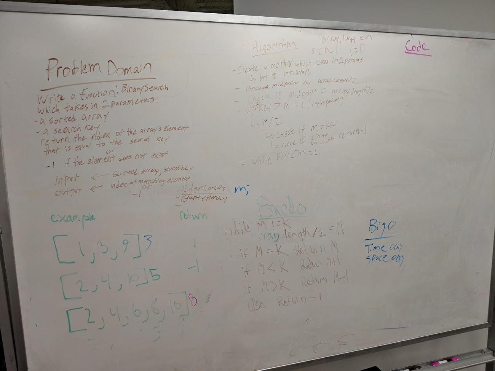

# ArrayReverse - Reverse an Array
CodeFellows - 401 - Java
Code Challenge 01: Data & Algorithm Challenge
## Challenge
Write a function called reverseArray which takes an array of integers as an argument. Without utilizing any of the built-in methods available to java, return an array with the elements in reversed order.

[View the code](../../src/main/java/ArrayReverse.java) | [View the test](../../src/test/ArrayReverseTest.java)
## Example Input/Output
|Input  |Output |
|---	|---	|
|[1, 2, 3, 4, 5, 6]   	| [6, 5, 4, 3, 2, 1]  	|
|[89, 2354, 3546, 23, 10, -923, 823, -12]|[-12, 823, -923, 10, 23, 3546, 2354, 89]   	|

## Approach & Efficiency

Writing a static method taking in an array of integers. First instantiating a new array instance as a holder for the reversed array by finding the length.

Then for each index of the new array and for each index we iterate through each of the input array by its length - 1 for the last index of the input array by the iteration.

As a result, we return the array new instance of the reversed array.
## Solution
<!-- Embedded whiteboard image -->

