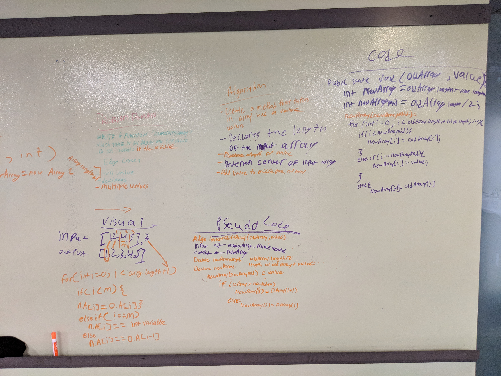

# ArrayShift - Shift an Array
CodeFellows - 401 - Java
Challenge 02: Data & Algorithm Challenge
## Challenge
Write a function called `insertShiftArray` which takes in an array and the value to be added. Without utilizing any of the built-in methods available to java, return an array with the new value added at the middle index.

Write a function calle `removeShiftArray` which deletes the middle index element and shifts the element to fill the gap of the removed element to fill in the new gap.

[View the code](../../src/main/java/ArrayShift/ArrayShift.java) | [View the test](../../src/test/ArrayShift/ArrayShiftTest.java)
## Example Input/Output

#### insertShiftArray
|Input  |Output |
|---	|---	|
|[2,4,6,8], 5  	| [2,4,5,6,8]  	|
|[4,8,15,23,42], 16 | [4,8,15,16,23,42]  |

#### removeShiftArray
|Input  |Output |
|---	|---	|
|[2,4,5,6,8]  	| [2,4,6,8]  	|
|[4,8,15,16,23,42] | [4,8,15,23,42]  |

## Approach & Efficiency

#### insertShiftArray

We begin by finding out the length of the input array, we first, create a new instance of the input array in our `insertShiftArray` method.

To find the midpoint index of our new instance of the array, we first use a conditional statement to figure out whether we have back a odd or even length array. If the length of the input array is even, then we will divide by 2 and use the result as our midpoint index. If the result is odd then we will divide the length of the input array - 1 to divide by 2 and use the result as the midpoint index.

Once we have the midpoint, we will use a for loop to declare each index of the instantiated array to return to be the same as the input array up to the midpoint. If the index is the same as the midpoint, that current index will be declared the same as our input value. Otherwise, we will finish our iteration up to the length of the input array - 1.

#### removeShiftArray

We first check if the input array has a length of less than 2. If it does, we can assume there isn't a midpoint index to remove.

Otherwise, we will instantiate a new array to return and find a midpoint by using a conditional statement to figure out whether we have back a odd or even length array. If the length of the input array is even, then we will divide by 2 and use the result as our midpoint index. If the result is odd then we will divide the length of the input array - 1 to divide by 2 and use the result as the midpoint index.

We will then iterate to the midpoint declare each index of the result array to match the input array. Once we iterate to the midpoint, we skip the match by adding one until the end and return the result array.

#### Efficiency

Efficiency for both:

Space: O(n) | Time: O(n)

## Intial WhiteBoard Solution
<!-- Embedded whiteboard image -->

