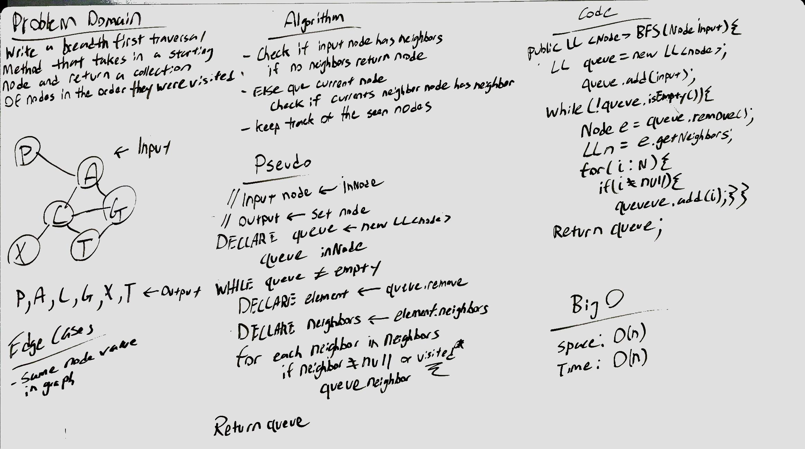
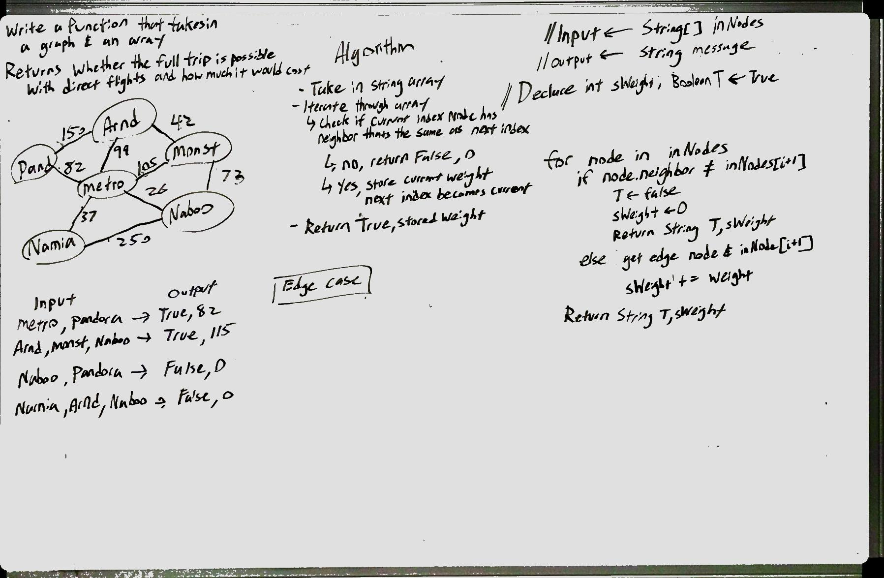

# Graphs
CodeFellows - 401 - Java
CODE: Implement a Graph

### Challenge: Code - Graph
The implemented Graph class should be represented as an adjacency list, and should include:
* AddNode()
* AddEdge()
* GetNodes()
* GetNeighbors
* Size()

### Challenge: 09 - Breadth-First Search
Implement a breadth-first traversal on a graph.

### Challenge: 10 - Get Edge
Given a business trip itinerary, and an Alaska Airlines route map, is the trip possible with direct flights? If so, how much will the total trip cost be?

Write a function that takes in a graph, and an array of city names. Return whether the full trip is possible with direct flights, and how much it would cost.

## Approach & Efficiency
Approach to first iterate over the nodes to find the one whose data matches input array at data index 0. This will be our staring node.

Using a nested for loops, we go through its edges to find matching neighbors and the cities within the array. If a match is found then the starting node becomes that neighbor node. While aggregating the initialized price aggregate variable.

If at any point the method cannot find a direct connection to the next city, the function will return "False, 0" otherwise, if the nested for loops is allowed to finish, it will return the string "True, " concacted with the price aggregate variable.

### Challenge: 11 - Get Edge
Still working

## Approach & Efficiency
Creating a Graph specific node and edge class, each vertex in the graph is associated with the group of its neighboring vertices or edges.

In a weighted graph using adjacency list. Implementation is similar to that of unweighted graph, except we're also storing the weight information in adjacency set with every edge.

## API
Modifiers and Type      | Class       | Method    | Description | Big O |
|---                    | ---         | ---     |         --- | --- |
|  java.util*      |`Graph `  | `addNode()`   | Adds a new node to the graph then takes in the value of that node to return the added nodes | Space: O(1) Time: O(1)|
|  java.util*      |`Graph `  | `addEdge()`   | Adds a new edge between two nodes in the graph; also include the ability to have a "weight", both nodes should have already be in the Graph, takes in two nodes to be connected by the edge | Space: O(1) Time: O(1) |
|  java.util*       |`Graph `  | `getNodes()`   | Return all of the nodes in the graph as a collection |  Space: O(1) Time: O(1)
|  java.util*       |`Graph `  | `getNeighbors(Node node)`   | Returns a collection of nodes connected to the give node |  Space: O(1) Time: O(1)|
|  java.util*       |`Graph `  | `size()`   | Returns a collection of nodes connected to the give node |  Space: O(1) Time: O(1)
|  java.util*       |`Graph `  | `bfs(Node input)`   | Returns a collection of nodes given a starting point node using bread-first search method |  Space: O(n) Time: O(n)
|  java.util*       |`Graph `  | `getEdge(String arrayCityNames)`   | Write a function that takes in a graph, and an array of city names. Return whether the full trip is possible with direct flights, and how much it would cost. |  Space: O(1) Time: O(n)
|  java.util*       |`Graph `  | `depthFirstTraversal(Node input)`   | Still working |  Space: O(n) Time: O(n)
