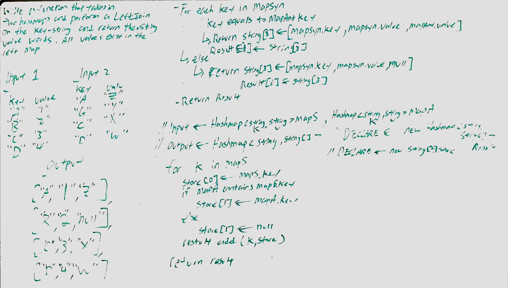

# CodeFellows - 401 - Java
Code Challenge - Implement a simplified Left Join for 2 Hashmaps

### Challenge: Code - HashTable
Write a function that Left Joins two Hashmaps into a single data structure.

The first parameter is a Hashmap that has word strings as keys, and a synonym of the key as values

The second parameter is a Hashmap that has word strings as keys, and antonyms of the key as values.

Combine the key and corresponding values(if they exist) into a new data structure according to Left Join logic

Left Join - means all the values in the first Hashmap are returned, and if values exist in the "right" hashmap, they are appended to the result row. If no value exist in the right Hashmap, then some flavor of NULL should be appended to the result row.

## Approach & Efficiency

We will instantiate a new string 2d array. Where the inner loop is the size of three for the matching key and their respective values. While the outer loop will be the size of the array-list that contains the key-set of the Hashmap that contains the synonyms.

Using that array-list of keys we will iterate through the list to place each inner loop with their respective key and synonym value. At which point we will also check if the key exists in the antonym map and return value if exist, or null, if it doesn't.

## API
Modifiers and Type      | Class       | Method    | Description | Big O |
|---                    | ---         | ---     |         --- | --- |
|  java.util*      |`Hashtable.LeftJoin `  | `leftJoin(Hashmap<String, String>, Hashmap<String, String)`   | Take in two hashmap with string keys and values and return the left join, if the key for the right hashmap doesn't exist, then the return value will be nuk | Space: O(n) Time: O(n)|
