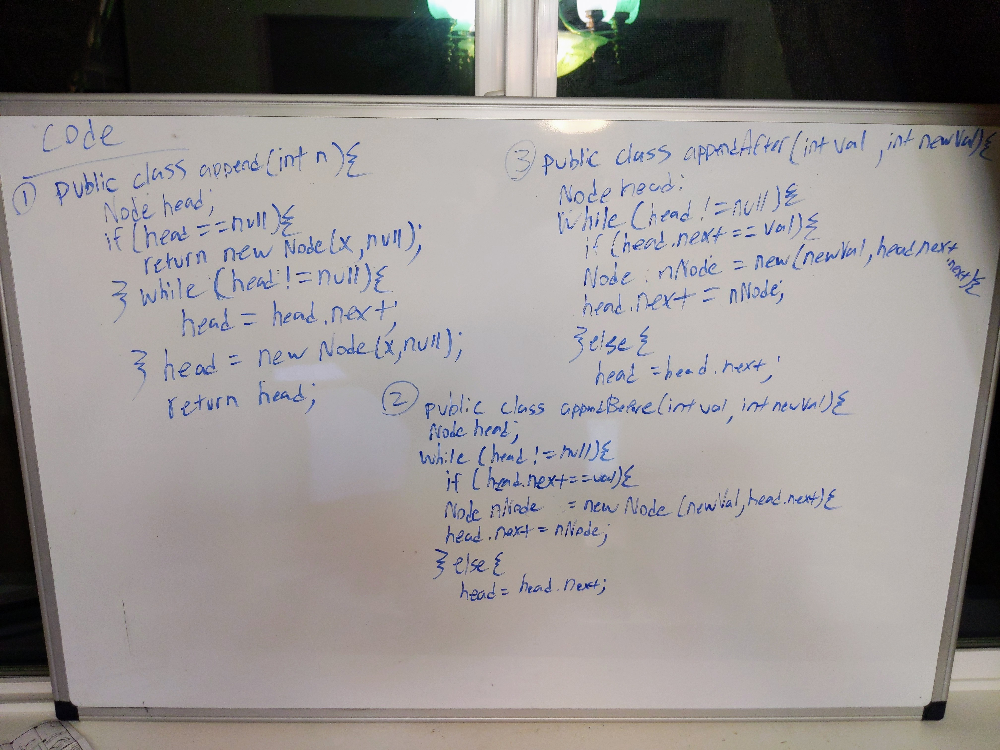

# Binary Search
CodeFellows - 401 - Java
Code Challenge 06: Data & Algorithm Challenge
## Challenge
Create a Node class that has properties for the value stored in the Node, and a pointer to the next Node

 ## Approach & Efficiency
Created LinkedList and Node class

append(value) which adds a new node with the given value to the end of the list
    Space Efficiency: O(n)
    Time Efficiency: O(n)
insertBefore(value, newVal) which add a new node with the given newValue immediately before the first value node
   Space Efficiency: O(n)
    Time Efficiency: O(n)
insertAfter(value, newVal) which add a new node with the given newValue immediately after the first value node
   Space Efficiency: O(n)
    Time Efficiency: O(n)

## API

Java ai API was used to support for system input and output through data streams for assertion test

<!-- Embedded whiteboard image -->

