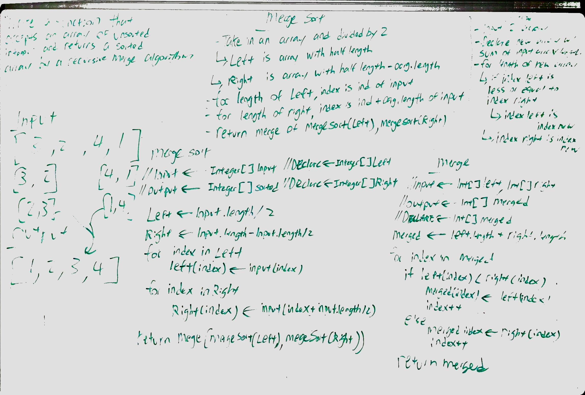

# Merge Sort Sort
CodeFellows - 401 - Java
Code Challenge - 15: Merge Sort

### Challenge: Code - Insertion Sort
Write a function that accepts an array of unsorted integers, and returns a sorted array by a recursive mergesort algorithm.

## Approach & Efficiency

We recursively taking in the unsorted input array, divide its length by 2 to partition a left and right halves. The base case for this method is if the array lenth is 1 or less, at which point will return the array.

We then merge the halved arrays by taking in the two halves into a separate method helper. Within it we instatiate a new array with the combined length of both halves and iterate through the combined array while comparing whichever value is lesser in the left or right array index for each index position in the combined array. Whichever is lesser, we place that specific index value of either left or right at that point in the combined array and increment its respective counter to account for any all the values in the halved arrays. If at any point the increment count is greater than its respective original array length, then we can assume the next value to be that of the other half.

##### Approach
We begin by identifying the key for our comparison as index i.

While the key is less than the value of index j and greater than position 0, then the key moves one position to the left. The process continues until we reach to a value that is smaller than the key. At which point we change the key to the next index of j and repeat the process until the while condition no longer applies.

##### Efficiency
Since we utilized recursion in merge sort, the time complexity needs to account the time as well when we sort the halved-arrays and o(n) time when we merge the entire array, which will result in a o(nLogn)

The space complexity is o(n) since we are creating a temporary array in every recursive call.

## API
Modifiers and Type      | Class       | Method    | Description | Big O |
|---                    | ---         | ---     |         --- | --- |
|  java.util*      |`MergeSort `  | `mergeSort(int[] inputArray)`   | takes in an unsorted array and returns the array sorted using merge sort | Space: O(n) Time: O(nLogn)|
