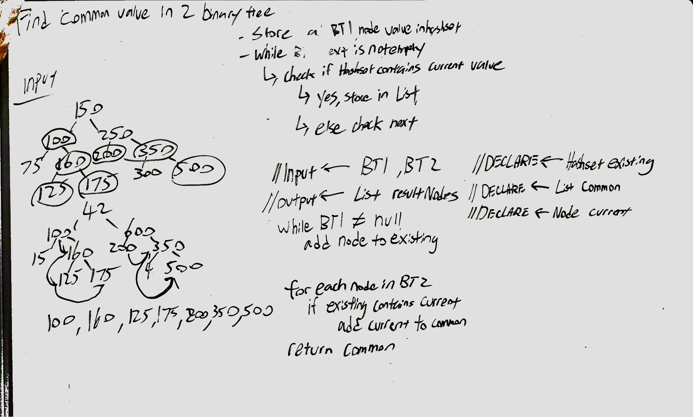

# CodeFellows - 401 - Java
Code Challenge - Find common values in two binary trees.

### Challenge: Code - Tree Intersection
Write a function called treeIntersection that takes two binary trees as parameter.

Return a list of values found in both trees.

## Approach & Efficiency

We will in order traverse through both input binary tree and instantiate set for each tree to be checked against one another.

We will then iterate through the first set of Nodes checking against the second set of nodes. If both set contins the node then we would add the current node in the iteration to the arraylist which we will return once all nodes are checked.

## API
Modifiers and Type      | Class       | Method    | Description | Big O |
|---                    | ---         | ---     |         --- | --- |
|  java.util*      |`treeIntersection `  | `leftJoin(Hashmap<String, String>, Hashmap<String, String)`   | Take in two binarty trees and return the common values in both the trees | Space: O(n) Time: O(n)|
