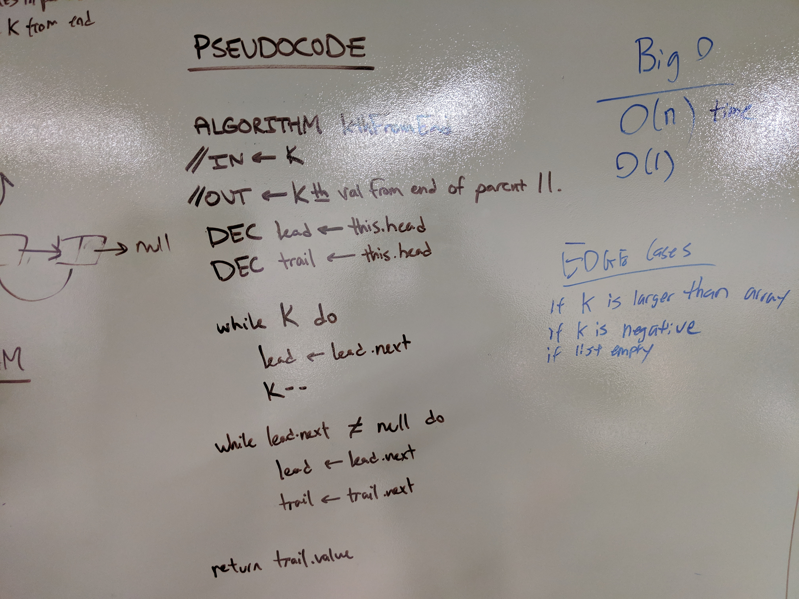

# Linked List
CodeFellows - 401 - Java
Code Challenge 07
## Challenge
Write a method for the Linked List Class which takes a number, k , as a parameter. Return the node's value that is k from the end of the linked list

## Approach & Efficiency
Through iterating the linked list, we move the first pointer `lead ` by k.

Then we move both the pointer and when the first pointer reaches the end of the list the seond pointer will be at the kth node from the end

return the kth node data

### Space Efficiency O(1)

### Time Efficiency: O(n)

## API

<!-- Embedded whiteboard image -->
