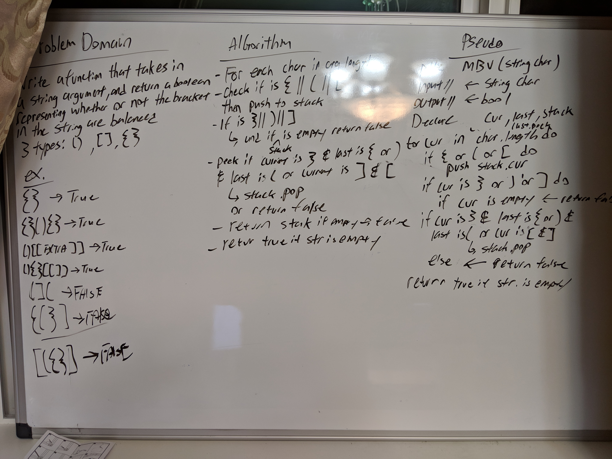

# Multi-Bracket-Validation
Creating a balanced bracket validation method
[Code](../../src/main/java/multibracketvalidation) | [Tests](../../src/test/java/multibracketvalidation)

## Challenge
Create a function which takes in a string as its only argument, and returns a boolean representing whether or not the bracket in the string are balanced. There are 3 types of brackets:

    * Round Brackets `()`
    * Square Brackets `[]`
    * Curly Brackets `{}`

## Approach & Efficiency
My approach is to iterate throught the argument string, and `.push` into a Stack of characters if any of the character is opened: `{`, `[`, or `(`.

We can then assume we are able to pop off any closed:  `}`, `]`, or `)`.

We must also check if after every last bracket/parenthesis that opens, the same must close.

### Big O

 Time:  O(n)

 Space: O(n)

## API
| Method | Description |
| --- | --- |
| `push(element)` | Takes any value as an argument and adds a new node with that value to the top of the stack |
| `pop()` | Does not take any argument, removes the node from the top of the stack, and returns the node |
| `peek()` | Does not take any argument and returns the node located on the top or front of the stack |

## Credit
Referenced problem 9 in "Cracking The Coding Inteview", to help figure out the current and last matches.
<!-- Embedded whiteboard image -->

